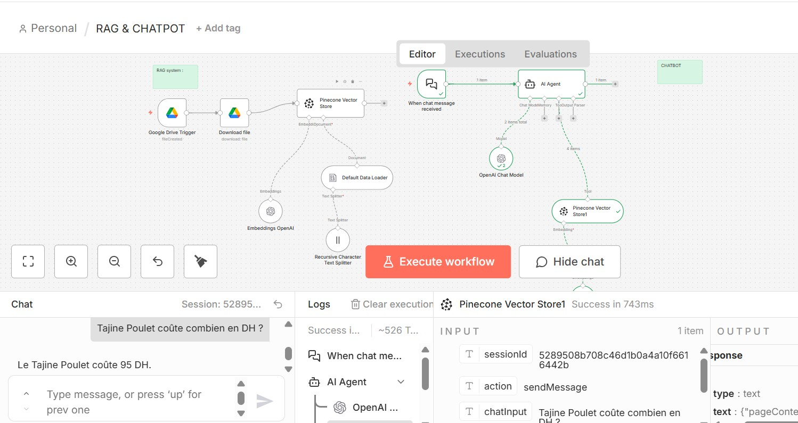

# 🍽️ RAG Chatbot — Menu d'un Restaurant Marocain

Système de **Retrieval-Augmented Generation (RAG)** permettant aux clients de poser des questions sur le menu d'un restaurant marocain et de recevoir des réponses précises et contextuelles, basées uniquement sur les données réelles du menu.

Plutôt que de fine-tuner un modèle, ce projet utilise une **base de données vectorielle** et une **récupération en temps réel** pour améliorer la fiabilité des réponses et réduire les hallucinations du LLM.

---

## 🖼️ Aperçu

### Workflow n8n complet

### Résultat du chatbot en action

---

## 🧠 Fonctionnement du système

### 1. Pipeline d'ingestion des données
- Le menu du restaurant est déposé sur **Google Drive**
- Le workflow détecte automatiquement le nouveau fichier
- Le document est découpé en chunks (segments de texte)
- Des **embeddings OpenAI** sont générés pour chaque chunk
- Les vecteurs sont stockés dans **Pinecone** (base de données vectorielle)

### 2. Pipeline du chatbot
- L'utilisateur envoie une question
- La question est transformée en embedding
- Les chunks les plus pertinents sont récupérés depuis Pinecone
- Le LLM génère une réponse contextuelle basée **uniquement** sur les données récupérées

---

## 💡 Exemples de questions

- Quels plats marocains sont disponibles ?
- Quels sont les ingrédients du tajine ?
- Quel est le prix du couscous ?
- Ce plat contient-il des allergènes ?

---

## ⚙️ Stack technique

| Composant | Rôle |
|---|---|
| **n8n** | Automatisation du workflow |
| **Pinecone** | Base de données vectorielle |
| **OpenAI** | Embeddings + modèle de chat |
| **LangChain nodes (n8n)** | Orchestration RAG |
| **Google Drive** | Source et déclencheur du pipeline d'ingestion |

---

## 🎯 Compétences démontrées

- Conception d'une architecture RAG complète (ingestion + retrieval + génération)
- Utilisation de bases de données vectorielles (Pinecone)
- Automatisation de pipelines d'ingestion de documents
- Réduction des hallucinations dans les systèmes LLM
- Construction de workflows IA scalables avec n8n

---

## 🎥 Démonstration

Une vidéo montrant l'exécution complète du workflow et les réponses en temps réel est disponible dans ce dépôt : `demo.mp4` *(à ajouter/renommer selon votre fichier)*.

---

## 🚀 Comment reproduire ce projet

1. Créer un compte [Pinecone](https://www.pinecone.io/) et récupérer une clé API
2. Créer une clé API [OpenAI](https://platform.openai.com/)
3. Importer le fichier `.json` du workflow dans votre instance n8n
4. Configurer les credentials (Google Drive, OpenAI, Pinecone) dans n8n
5. Déposer un menu (PDF/texte) dans le dossier Google Drive connecté
6. Tester le chatbot avec vos propres questions

> ⚠️ Aucune clé API n'est incluse dans ce dépôt. Configurez vos propres credentials dans n8n avant utilisation.

---

## 📌 Auteur

Projet réalisé par **Sara Maggag** dans le cadre d'une démonstration de compétences en automatisation IA et architectures RAG.
